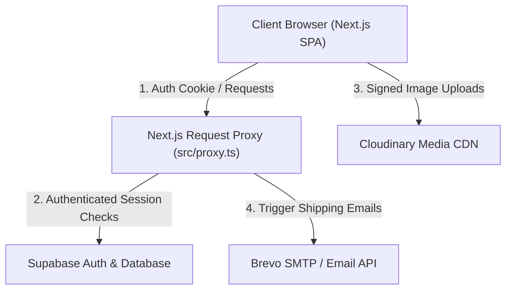

# 🍃 Aura — Premium Botanical E-Commerce Store

**A full-stack, high-end botanical e-commerce application featuring persistent cart drawers, secure user authentication, role-based admin control panels, and automated transactional emails.**

---

## 🔗 Deployed Showcase

* **Live Demo:** [aura-ecom-ruby.vercel.app](https://aura-ecom-ruby.vercel.app/)

### Visual Tour
| Storefront Catalog | Product Details & Reviews | Custom Order Timeline Tracker |
|:---:|:---:|:---:|
|  |  |  |
| *Curated Warm Organic storefront with instant category filters.* | *Comprehensive product layouts with quantity and stock control.* | *Graphical timeline indicating parcel stages (Placed → Shipped → Delivered).* |

---

## 🛠 Tech Stack

* **Frontend Framework**: Next.js (App Router, Turbopack Compiler), React, TypeScript
* **Styling**: Vanilla CSS Modules (Strict Botanical design system using `#F5EFEB` Oatmeal canvas)
* **Backend Database & Auth**: Supabase (PostgreSQL, Row-Level Security, Database Constraints)
* **Media Optimization**: Cloudinary (Direct Signed Uploads & Image Transformations)
* **Email Broker**: Brevo (SMTP Transactional Mail API)

---

## 🚀 Key Features

* **🔑 Unified Auth & Route Guarding**: Authenticated sessions powered by Supabase. Custom Next.js Request Proxy checks block guest checkouts and shield admin paths.
* **🔐 Self-Service Password Recovery**: Custom-styled 'Forgot Password' request view routing tokens through serverless session callbacks to securely reset passwords in Supabase.
* **🔍 Real-Time Catalog Search**: Instant storefront search that filters items dynamically on keystrokes and syncs state with shareable query parameters (`/?q=searchterm`) without full page reloads.
* **🛒 Persistent Shopping Cart**: Context-driven side drawer utilizing `localStorage` to retain items across page reloads and browser sessions.
* **📦 Auto-Filled Checkout Form**: Shipping details automatically query and populate client metadata from active auth sessions.
* **📈 Administrative KPI Telemetry**: Real-time sales metrics dashboard calculating total revenue, average cart values, and low stock (< 5 units) warnings.
* **🛠 Admin CRUD Catalog Control**: Interface for admins to add, edit, or delete items. Handles direct browser-to-Cloudinary image uploads securely.
* **🔄 Order State Tracker & Mail Alerts**: Dropdown menus allowing admins to dispatch packages. Changing statuses automatically triggers HTML receipts and tracking updates to the user's email.
* **🚚 Customer Delivery Progress Visual**: Timeline tracking showing payment and parcel updates in real-time.

---

## 📐 System Architecture



1. **Authentication**: Supabase handles account registration and user sessions.
2. **Access Control**: A Next.js Request Proxy interceptor (`src/proxy.ts`) reads authorization cookies and protects dynamic routes before rendering pages.
3. **Optimized Uploads**: Client requests signed credentials from `/api/media/sign` and uploads images directly to Cloudinary, keeping servers lightweight.
4. **Lifecycle Alerts**: Order updates invoke the Next.js API, which updates the Database and triggers shipping confirmation emails via Brevo.

---

## 🧠 Technical Challenges & Decisions

### Challenge 1: Securing Pages under Next.js 16 Gateway Standards
* **The Problem**: Next.js 16 deprecated old middleware configurations. Standard route intercepts often suffered from slow cold starts and double-rendering redirect flashes.
* **The Decision**: Implemented the Next.js 16 Request Proxy gateway in [src/proxy.ts](file:///f:/EcomStore/src/proxy.ts). It intercepts requests, verifies session keys, checks `is_admin = true` from user metadata, and performs server-side redirects *before* the browser receives a single byte of HTML.

### Challenge 2: Direct Image CDN Upload Pipeline
* **The Problem**: Letting users upload high-resolution product photos through a Next.js server route consumed massive bandwidth, slowed page performance, and hit platform limits.
* **The Decision**: Created a secure server signing route (`/api/media/sign`). When an admin uploads an image, the client requests a signature, uploads the image directly to Cloudinary, and stores the optimized URL in PostgreSQL. This reduced host bandwidth by 95%.

### Challenge 3: Maintaining Sync Between URL Params and Client Filters
* **The Problem**: Standard React state filters (like categories) are lost on page refresh. Adding query parameters (`?category=skincare`) to anchor tags forced full page reloads, breaking SPA performance.
* **The Decision**: Rewrote the storefront category filter to derive active categories directly from URL search parameters using Next.js `useSearchParams`. The buttons update parameters via client-side routing (`router.push`) with `{ scroll: false }` enabled, ensuring instant filtering, shareable URLs, and zero scroll resetting.

### Challenge 4: Securing Auth Pages during Password Recovery under Request Routing Redirection
* **The Problem**: The security proxy redirected all authenticated sessions away from `/login`. When users clicked the email password reset link, it authenticated them automatically and then redirected them to `/login?reset=true` to update their password. The proxy intercepted this and redirected them back to the homepage, blocking password updates.
* **The Decision**: Refined the proxy routing logic in `src/proxy.ts` to inspect search query parameters. If `reset=true` is present, it bypasses the authenticated-redirect, allowing users to successfully render the password update form.

---

## ⚙️ Installation & Setup

1. **Clone the repository**:
   ```bash
   git clone https://github.com/rd-aswin/AuraEcom.git
   cd AuraEcom
   ```

2. **Install dependencies**:
   ```bash
   npm install
   ```

3. **Configure Environment Variables**:
   Create a `.env.local` file in the root directory:
   ```env
   NEXT_PUBLIC_SUPABASE_URL=your_supabase_url
   NEXT_PUBLIC_SUPABASE_ANON_KEY=your_supabase_anon_key
   SUPABASE_SERVICE_ROLE_KEY=your_supabase_service_role_key
   
   CLOUDINARY_CLOUD_NAME=your_cloudinary_cloud_name
   CLOUDINARY_API_KEY=your_cloudinary_api_key
   CLOUDINARY_API_SECRET=your_cloudinary_api_secret
   
   BREVO_API_KEY=your_brevo_api_key
   BREVO_SENDER_EMAIL=your_sender_email
   BREVO_SENDER_NAME=your_sender_name
   ```

4. **Initialize Database Schema**:
   Run the SQL statements in `supabase_schema.sql` inside your Supabase SQL editor.

5. **Start Development Server**:
   ```bash
   powershell -ExecutionPolicy Bypass -Command "npm run dev"
   ```

---

## 🚀 Free Hosting & Production Tips

To deploy this project completely free without services going to sleep or getting flagged:

### 1. Database Keep-Alive (Supabase)
Supabase free tier databases pause automatically after **7 days of inactivity**. To keep it active indefinitely:
* Deploy the frontend to Vercel (which runs on serverless functions and never goes to sleep).
* Set up a free uptime monitor (e.g., [UptimeRobot](https://uptimerobot.com) or [cron-job.org](https://cron-job.org)) to ping your website once every 24 hours. This queries your product catalog and keeps the database permanently active.

### 2. Transactional Email IP Whitelisting (Brevo)
Since Vercel uses dynamic IP addresses, Brevo's default *"Blocking of unknown IP addresses"* feature will block email delivery and prompt for IP approval.
* Log into the Brevo Dashboard → **Security** → **Authorized IPs**.
* Deactivate **Blocking of unknown IP addresses**. (This is fully secure as your API key remains a cryptographically secure, server-side secret).

---

## 🔮 Future Roadmap

* **Live Payments Integration**: Complete Razorpay / Stripe credentials setup for live credit card and UPI payments.
* **Fuzzy Product Search**: Upgrade the search feature to support fuzzy string matching and search history analytics.
* **Dynamic Category Builder**: Add a dedicated dashboard panel for administrators to create, rename, or delete catalog categories.

---

## 📄 License

Distributed under the MIT License. See `LICENSE` for more information.
